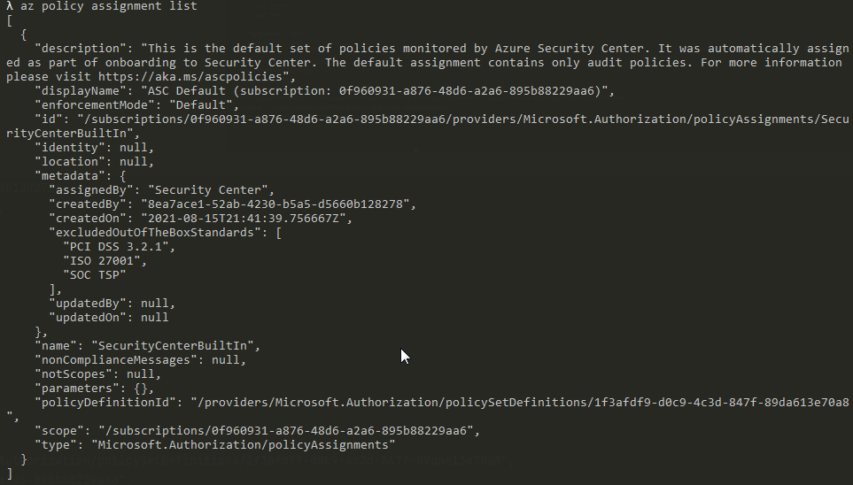

# Azure Infrastructure Operations Project: Deploying a scalable IaaS web server in Azure

### Introduction
In this project allows to use the included Packer and Terraform template to deploy a customizable, scalable web server in Azure.

### Getting Started
1. Clone this repository

2. Create your infrastructure as code

3. Update this README to reflect how someone would use your code.

### Dependencies
1. Create an [Azure Account](https://portal.azure.com) 
2. Install the [Azure command line interface](https://docs.microsoft.com/en-us/cli/azure/install-azure-cli?view=azure-cli-latest)
3. Install [Packer](https://www.packer.io/downloads)
4. Install [Terraform](https://www.terraform.io/downloads.html)

### Instructions
1. Deploy the Packer image using the provided Packer template

In order to configure the environment variables use this snippet:
```
export ARM_CLIENT_ID=YOUR_ARM_CLIENT_ID
export ARM_CLIENT_SECRET=YOUR_ARM_CLIENT_SECRET
export ARM_SUBSCRIPTION_ID=YOUR_ARM_SUBSCRIPTION_ID
export ARM_TENANT_ID=YOUR_ARM_TENANT_ID
```
In order to retrieve the needed values be sure to follow [this tutorial](https://registry.terraform.io/providers/hashicorp/azurerm/latest/docs/guides/service_principal_client_secret).

Create a resource group in Azure:
```
az group create -n tagging-policy-rg -l eastus
```

### Output
```
E:\bitbucket\azure-cloud-devops-scalable-iaas-webserver (main -> origin)
λ az group create -n tagging-policy-rg -l eastus
{
  "id": "/subscriptions/0f960931-a876-48d6-a2a6-895b88229aa6/resourceGroups/tagging-policy-rg",
  "location": "eastus",
  "managedBy": null,
  "name": "tagging-policy-rg",
  "properties": {
    "provisioningState": "Succeeded"
  },
  "tags": null,
  "type": "Microsoft.Resources/resourceGroups"
}
```

Create a policy in Azure:
```
az policy definition create --name allResourcesMustHaveTags --rules azure_policy_all_indexed_resources_in_subscription_must_have_tags.json
```

Show the created policy:
```
az policy assignment list
```



Deploy the Packer image:  
```packer build server.json```

### Output
```
E:\bitbucket\azure-cloud-devops-scalable-iaas-webserver (main -> origin)
λ packer build server.json
azure-arm: output will be in this color.

==> azure-arm: Running builder ...
==> azure-arm: Getting tokens using client secret
==> azure-arm: Getting tokens using client secret
    azure-arm: Creating Azure Resource Manager (ARM) client ...
==> azure-arm: WARNING: Zone resiliency may not be supported in East US, checkout the docs at https://docs.microsoft.com/en-us/azure/availability-zones/
==> azure-arm: Creating resource group ...
==> azure-arm:  -> ResourceGroupName : 'pkr-Resource-Group-awix30bt3m'
==> azure-arm:  -> Location          : 'East US'
==> azure-arm:  -> Tags              :
==> azure-arm:  ->> udacity : udacity-project1-image
==> azure-arm: Validating deployment template ...
==> azure-arm:  -> ResourceGroupName : 'pkr-Resource-Group-awix30bt3m'
==> azure-arm:  -> DeploymentName    : 'pkrdpawix30bt3m'
==> azure-arm: Deploying deployment template ...
==> azure-arm:  -> ResourceGroupName : 'pkr-Resource-Group-awix30bt3m'
==> azure-arm:  -> DeploymentName    : 'pkrdpawix30bt3m'
==> azure-arm:
==> azure-arm: Getting the VM's IP address ...
==> azure-arm:  -> ResourceGroupName   : 'pkr-Resource-Group-awix30bt3m'
==> azure-arm:  -> PublicIPAddressName : 'pkripawix30bt3m'
==> azure-arm:  -> NicName             : 'pkrniawix30bt3m'
==> azure-arm:  -> Network Connection  : 'PublicEndpoint'
==> azure-arm:  -> IP Address          : '13.82.198.207'
==> azure-arm: Waiting for SSH to become available...
==> azure-arm: Connected to SSH!
==> azure-arm: Provisioning with shell script: C:\Users\Pitto\AppData\Local\Temp\packer-shell346820747
==> azure-arm: + echo Hello, World!
==> azure-arm: + nohup busybox httpd -f
==> azure-arm: Querying the machine's properties ...
==> azure-arm:  -> ResourceGroupName : 'pkr-Resource-Group-awix30bt3m'
==> azure-arm:  -> ComputeName       : 'pkrvmawix30bt3m'
==> azure-arm:  -> Managed OS Disk   : '/subscriptions/0f960931-a876-48d6-a2a6-895b88229aa6/resourceGroups/pkr-Resource-Group-awix30bt3m/providers/Microsoft.Compute/disks/pkrosawix30bt3m'
==> azure-arm: Querying the machine's additional disks properties ...
==> azure-arm:  -> ResourceGroupName : 'pkr-Resource-Group-awix30bt3m'
==> azure-arm:  -> ComputeName       : 'pkrvmawix30bt3m'
==> azure-arm: Powering off machine ...
==> azure-arm:  -> ResourceGroupName : 'pkr-Resource-Group-awix30bt3m'
==> azure-arm:  -> ComputeName       : 'pkrvmawix30bt3m'
==> azure-arm: Capturing image ...
==> azure-arm:  -> Compute ResourceGroupName : 'pkr-Resource-Group-awix30bt3m'
==> azure-arm:  -> Compute Name              : 'pkrvmawix30bt3m'
==> azure-arm:  -> Compute Location          : 'East US'
==> azure-arm:  -> Image ResourceGroupName   : 'tagging-policy-rg'
==> azure-arm:  -> Image Name                : 'myPackerImage'
==> azure-arm:  -> Image Location            : 'East US'
==> azure-arm:
==> azure-arm: Deleting individual resources ...
==> azure-arm: Adding to deletion queue -> Microsoft.Compute/virtualMachines : 'pkrvmawix30bt3m'
==> azure-arm: Adding to deletion queue -> Microsoft.Network/networkInterfaces : 'pkrniawix30bt3m'
==> azure-arm: Adding to deletion queue -> Microsoft.Network/virtualNetworks : 'pkrvnawix30bt3m'
==> azure-arm: Adding to deletion queue -> Microsoft.Network/publicIPAddresses : 'pkripawix30bt3m'
==> azure-arm: Waiting for deletion of all resources...
==> azure-arm: Attempting deletion -> Microsoft.Compute/virtualMachines : 'pkrvmawix30bt3m'
==> azure-arm: Attempting deletion -> Microsoft.Network/virtualNetworks : 'pkrvnawix30bt3m'
==> azure-arm: Attempting deletion -> Microsoft.Network/publicIPAddresses : 'pkripawix30bt3m'
==> azure-arm: Attempting deletion -> Microsoft.Network/networkInterfaces : 'pkrniawix30bt3m'
==> azure-arm: Error deleting resource. Will retry.
==> azure-arm: Name: pkripawix30bt3m
==> azure-arm: Error: network.PublicIPAddressesClient#Delete: Failure sending request: StatusCode=0 -- Original Error: Code="PublicIPAddressCannotBeDeleted" Message="Public IP address /subscriptions/0f960931-a876-48d6-a2a6-895b88229aa6/resourceGroups/pkr-Resource-Group-awix30bt3m/providers/Microsoft.Network/publicIPAddresses/pkripawix30bt3m can not be deleted since it is still allocated to resource /subscriptions/0f960931-a876-48d6-a2a6-895b88229aa6/resourceGroups/pkr-Resource-Group-awix30bt3m/providers/Microsoft.Network/networkInterfaces/pkrniawix30bt3m/ipConfigurations/ipconfig. In order to delete the public IP, disassociate/detach the Public IP address from the resource.  To learn how to do this, see aka.ms/deletepublicip." Details=[]
==> azure-arm:
==> azure-arm: Error deleting resource. Will retry.
==> azure-arm: Name: pkrvnawix30bt3m
==> azure-arm: Error: network.VirtualNetworksClient#Delete: Failure sending request: StatusCode=0 -- Original Error: Code="InUseSubnetCannotBeDeleted" Message="Subnet pkrsnawix30bt3m is in use by /subscriptions/0f960931-a876-48d6-a2a6-895b88229aa6/resourceGroups/pkr-Resource-Group-awix30bt3m/providers/Microsoft.Network/networkInterfaces/pkrniawix30bt3m/ipConfigurations/ipconfig and cannot be deleted. In order to delete the subnet, delete all the resources within the subnet. See aka.ms/deletesubnet." Details=[]
==> azure-arm:
==> azure-arm: Attempting deletion -> Microsoft.Network/publicIPAddresses : 'pkripawix30bt3m'
==> azure-arm: Attempting deletion -> Microsoft.Network/virtualNetworks : 'pkrvnawix30bt3m'
==> azure-arm:  Deleting -> Microsoft.Compute/disks : '/subscriptions/0f960931-a876-48d6-a2a6-895b88229aa6/resourceGroups/pkr-Resource-Group-awix30bt3m/providers/Microsoft.Compute/disks/pkrosawix30bt3m'
==> azure-arm: Removing the created Deployment object: 'pkrdpawix30bt3m'
==> azure-arm:
==> azure-arm: Cleanup requested, deleting resource group ...
==> azure-arm: Resource group has been deleted.
Build 'azure-arm' finished after 4 minutes 6 seconds.

==> Wait completed after 4 minutes 6 seconds

==> Builds finished. The artifacts of successful builds are:
--> azure-arm: Azure.ResourceManagement.VMImage:

OSType: Linux
ManagedImageResourceGroupName: tagging-policy-rg
ManagedImageName: myPackerImage
ManagedImageId: /subscriptions/0f960931-a876-48d6-a2a6-895b88229aa6/resourceGroups/tagging-policy-rg/providers/Microsoft.Compute/images/myPackerImage
ManagedImageLocation: East US


E:\bitbucket\azure-cloud-devops-scalable-iaas-webserver (main -> origin)
```


2. Deploy the infrastructure using the provided Terraform template

Initialize Terraform:  
```terraform init```

Prepare the plan:  
```terraform plan -out solution.plan```

Deploy the plan:  
```terraform apply solution.plan```

### Output
```
E:\bitbucket\azure-cloud-devops-scalable-iaas-webserver (main -> origin)
λ terraform apply

Terraform used the selected providers to generate the following execution plan. Resource actions are indicated with
the following symbols:
  + create

Terraform will perform the following actions:

  # azurerm_linux_virtual_machine.main[0] will be created
  + resource "azurerm_linux_virtual_machine" "main" {
      + admin_password                  = (sensitive value)
      + admin_username                  = "username"
      + allow_extension_operations      = true
      + computer_name                   = (known after apply)
      + disable_password_authentication = false
      + extensions_time_budget          = "PT1H30M"
      + id                              = (known after apply)
      + location                        = "eastus"
      + max_bid_price                   = -1
      + name                            = "prefix-vm-0"
      + network_interface_ids           = (known after apply)
      + platform_fault_domain           = -1
      + priority                        = "Regular"
      + private_ip_address              = (known after apply)
      + private_ip_addresses            = (known after apply)
      + provision_vm_agent              = true
      + public_ip_address               = (known after apply)
      + public_ip_addresses             = (known after apply)
      + resource_group_name             = "prefix-resources"
      + size                            = "Standard_D2s_v3"
      + virtual_machine_id              = (known after apply)
      + zone                            = (known after apply)

      + os_disk {
          + caching                   = "ReadWrite"
          + disk_size_gb              = (known after apply)
          + name                      = (known after apply)
          + storage_account_type      = "Standard_LRS"
          + write_accelerator_enabled = false
        }

      + source_image_reference {
          + offer     = "UbuntuServer"
          + publisher = "Canonical"
          + sku       = "18.04-LTS"
          + version   = "latest"
        }
    }

  # azurerm_linux_virtual_machine.main[1] will be created
  + resource "azurerm_linux_virtual_machine" "main" {
      + admin_password                  = (sensitive value)
      + admin_username                  = "username"
      + allow_extension_operations      = true
      + computer_name                   = (known after apply)
      + disable_password_authentication = false
      + extensions_time_budget          = "PT1H30M"
      + id                              = (known after apply)
      + location                        = "eastus"
      + max_bid_price                   = -1
      + name                            = "prefix-vm-1"
      + network_interface_ids           = (known after apply)
      + platform_fault_domain           = -1
      + priority                        = "Regular"
      + private_ip_address              = (known after apply)
      + private_ip_addresses            = (known after apply)
      + provision_vm_agent              = true
      + public_ip_address               = (known after apply)
      + public_ip_addresses             = (known after apply)
      + resource_group_name             = "prefix-resources"
      + size                            = "Standard_D2s_v3"
      + virtual_machine_id              = (known after apply)
      + zone                            = (known after apply)

      + os_disk {
          + caching                   = "ReadWrite"
          + disk_size_gb              = (known after apply)
          + name                      = (known after apply)
          + storage_account_type      = "Standard_LRS"
          + write_accelerator_enabled = false
        }

      + source_image_reference {
          + offer     = "UbuntuServer"
          + publisher = "Canonical"
          + sku       = "18.04-LTS"
          + version   = "latest"
        }
    }

  # azurerm_network_interface.main[0] will be created
  + resource "azurerm_network_interface" "main" {
      + applied_dns_servers           = (known after apply)
      + dns_servers                   = (known after apply)
      + enable_accelerated_networking = false
      + enable_ip_forwarding          = false
      + id                            = (known after apply)
      + internal_dns_name_label       = (known after apply)
      + internal_domain_name_suffix   = (known after apply)
      + location                      = "eastus"
      + mac_address                   = (known after apply)
      + name                          = "prefix-nic-0"
      + private_ip_address            = (known after apply)
      + private_ip_addresses          = (known after apply)
      + resource_group_name           = "prefix-resources"
      + tags                          = {
          + "udacity" = "prefix-project-1"
        }
      + virtual_machine_id            = (known after apply)

      + ip_configuration {
          + name                          = "internal"
          + primary                       = (known after apply)
          + private_ip_address            = (known after apply)
          + private_ip_address_allocation = "dynamic"
          + private_ip_address_version    = "IPv4"
          + subnet_id                     = (known after apply)
        }
    }

  # azurerm_network_interface.main[1] will be created
  + resource "azurerm_network_interface" "main" {
      + applied_dns_servers           = (known after apply)
      + dns_servers                   = (known after apply)
      + enable_accelerated_networking = false
      + enable_ip_forwarding          = false
      + id                            = (known after apply)
      + internal_dns_name_label       = (known after apply)
      + internal_domain_name_suffix   = (known after apply)
      + location                      = "eastus"
      + mac_address                   = (known after apply)
      + name                          = "prefix-nic-1"
      + private_ip_address            = (known after apply)
      + private_ip_addresses          = (known after apply)
      + resource_group_name           = "prefix-resources"
      + tags                          = {
          + "udacity" = "prefix-project-1"
        }
      + virtual_machine_id            = (known after apply)

      + ip_configuration {
          + name                          = "internal"
          + primary                       = (known after apply)
          + private_ip_address            = (known after apply)
          + private_ip_address_allocation = "dynamic"
          + private_ip_address_version    = "IPv4"
          + subnet_id                     = (known after apply)
        }
    }

  # azurerm_public_ip.main will be created
  + resource "azurerm_public_ip" "main" {
      + allocation_method       = "Static"
      + availability_zone       = (known after apply)
      + fqdn                    = (known after apply)
      + id                      = (known after apply)
      + idle_timeout_in_minutes = 4
      + ip_address              = (known after apply)
      + ip_version              = "IPv4"
      + location                = "eastus"
      + name                    = "prefix-publicIp"
      + resource_group_name     = "prefix-resources"
      + sku                     = "Basic"
      + sku_tier                = "Regional"
      + tags                    = {
          + "udacity" = "prefix-project-1"
        }
      + zones                   = (known after apply)
    }

  # azurerm_resource_group.main will be created
  + resource "azurerm_resource_group" "main" {
      + id       = (known after apply)
      + location = "eastus"
      + name     = "prefix-resources"
      + tags     = {
          + "udacity" = "prefix-project-1"
        }
    }

  # azurerm_subnet.internal will be created
  + resource "azurerm_subnet" "internal" {
      + address_prefix                                 = (known after apply)
      + address_prefixes                               = [
          + "10.0.0.0/24",
        ]
      + enforce_private_link_endpoint_network_policies = false
      + enforce_private_link_service_network_policies  = false
      + id                                             = (known after apply)
      + name                                           = "internal"
      + resource_group_name                            = "prefix-resources"
      + virtual_network_name                           = "prefix-network"
    }

  # azurerm_virtual_network.main will be created
  + resource "azurerm_virtual_network" "main" {
      + address_space         = [
          + "10.0.0.0/16",
        ]
      + dns_servers           = (known after apply)
      + guid                  = (known after apply)
      + id                    = (known after apply)
      + location              = "eastus"
      + name                  = "prefix-network"
      + resource_group_name   = "prefix-resources"
      + subnet                = (known after apply)
      + tags                  = {
          + "udacity" = "prefix-project-1"
        }
      + vm_protection_enabled = false
    }

Plan: 8 to add, 0 to change, 0 to destroy.

Do you want to perform these actions?
  Terraform will perform the actions described above.
  Only 'yes' will be accepted to approve.

  Enter a value: yes

azurerm_resource_group.main: Creating...
azurerm_resource_group.main: Creation complete after 2s [id=/subscriptions/0f960931-a876-48d6-a2a6-895b88229aa6/resourceGroups/prefix-resources]
azurerm_virtual_network.main: Creating...
azurerm_public_ip.main: Creating...
azurerm_public_ip.main: Creation complete after 5s [id=/subscriptions/0f960931-a876-48d6-a2a6-895b88229aa6/resourceGroups/prefix-resources/providers/Microsoft.Network/publicIPAddresses/prefix-publicIp]
azurerm_virtual_network.main: Creation complete after 7s [id=/subscriptions/0f960931-a876-48d6-a2a6-895b88229aa6/resourceGroups/prefix-resources/providers/Microsoft.Network/virtualNetworks/prefix-network]
azurerm_subnet.internal: Creating...
azurerm_subnet.internal: Creation complete after 4s [id=/subscriptions/0f960931-a876-48d6-a2a6-895b88229aa6/resourceGroups/prefix-resources/providers/Microsoft.Network/virtualNetworks/prefix-network/subnets/internal]
azurerm_network_interface.main[1]: Creating...
azurerm_network_interface.main[0]: Creating...
azurerm_network_interface.main[0]: Creation complete after 4s [id=/subscriptions/0f960931-a876-48d6-a2a6-895b88229aa6/resourceGroups/prefix-resources/providers/Microsoft.Network/networkInterfaces/prefix-nic-0]
azurerm_network_interface.main[1]: Creation complete after 7s [id=/subscriptions/0f960931-a876-48d6-a2a6-895b88229aa6/resourceGroups/prefix-resources/providers/Microsoft.Network/networkInterfaces/prefix-nic-1]
azurerm_linux_virtual_machine.main[1]: Creating...
azurerm_linux_virtual_machine.main[0]: Creating...
azurerm_linux_virtual_machine.main[1]: Still creating... [10s elapsed]
azurerm_linux_virtual_machine.main[0]: Still creating... [10s elapsed]
azurerm_linux_virtual_machine.main[1]: Still creating... [20s elapsed]
azurerm_linux_virtual_machine.main[0]: Still creating... [20s elapsed]
azurerm_linux_virtual_machine.main[1]: Still creating... [30s elapsed]
azurerm_linux_virtual_machine.main[0]: Still creating... [30s elapsed]
azurerm_linux_virtual_machine.main[1]: Still creating... [40s elapsed]
azurerm_linux_virtual_machine.main[0]: Still creating... [40s elapsed]
azurerm_linux_virtual_machine.main[1]: Still creating... [50s elapsed]
azurerm_linux_virtual_machine.main[0]: Still creating... [50s elapsed]
azurerm_linux_virtual_machine.main[0]: Creation complete after 53s [id=/subscriptions/0f960931-a876-48d6-a2a6-895b88229aa6/resourceGroups/prefix-resources/providers/Microsoft.Compute/virtualMachines/prefix-vm-0]
azurerm_linux_virtual_machine.main[1]: Still creating... [1m0s elapsed]
azurerm_linux_virtual_machine.main[1]: Still creating... [1m10s elapsed]
azurerm_linux_virtual_machine.main[1]: Still creating... [1m20s elapsed]
azurerm_linux_virtual_machine.main[1]: Creation complete after 1m23s [id=/subscriptions/0f960931-a876-48d6-a2a6-895b88229aa6/resourceGroups/prefix-resources/providers/Microsoft.Compute/virtualMachines/prefix-vm-1]

Apply complete! Resources: 8 added, 0 changed, 0 destroyed.

E:\bitbucket\azure-cloud-devops-scalable-iaas-webserver (main -> origin)
λ
```
